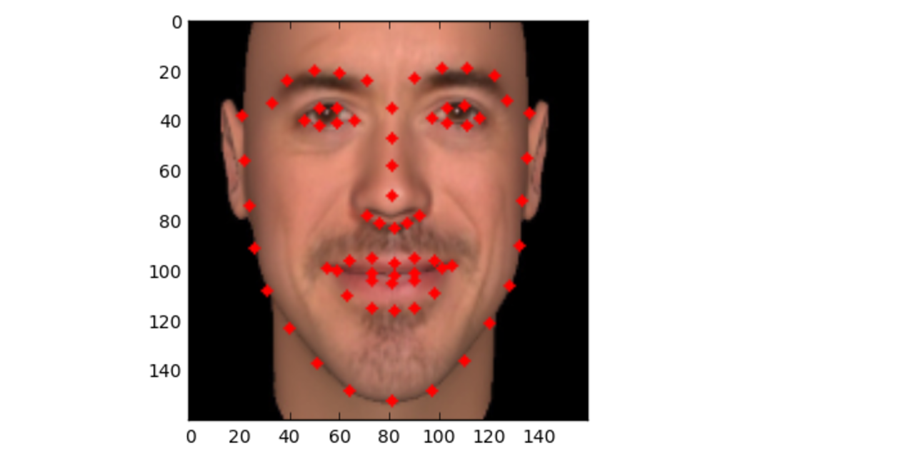

# 🎭 Face Recognition Attendance System


A **Face Recognition Attendance System** using **Python, TensorFlow, Keras, OpenCV, and SQLite3** to automate and secure attendance tracking.

## 🚀 Features

🔹 **Real-Time Face Recognition** using MTCNN & Deep Learning

🔹 **Automated Attendance Logging** in an Excel Sheet

🔹 **Secure Authentication** with Master Face Print

🔹 **Multi-Face Detection** with Feature Mapping

🔹 **Editable Attendance Records** with Secure Access

🔹 **Auto Daily Log Creation** to Prevent Data Overwrite

---
## 📌 Project Overview  
🔹 This system utilizes **MTCNN** to extract 128 facial feature maps and generates a **3D grid structure** for accurate facial recognition.  

🔹It will be seen as something like this 

🔹 Designed to provide an **automated attendance system** that records students' attendance in an Excel sheet.

---

## 🛠 Technologies Used

🐍 **Programming Language**: Python

📦 **Libraries & Frameworks**:
- 🧠 TensorFlow
- 🔬 Keras
- 📊 SQLite3
- 🖥️ Tkinter
- 🔍 OpenCV
- 🤖 MTCNN (for facial mapping)
---

## ⚡ How to Run the Project  
Run the files in the following order:  

```bash
!python main.py  
!python Auth.py  
!python screen.py

---


## 🏗 Installation & Setup

### 1️⃣ Clone the Repository
```bash
 git clone https://github.com/IshanGupta09/Face-Recognition-Attendance-System-by-Ishan.git
 cd Face-Recognition-Attendance-System-by-Ishan
```

### 2️⃣ Install Dependencies
```bash
pip install -r requirements.txt
```

### 3️⃣ Run the System
```bash
python main.py
python Auth.py
python screen.py
```

---

## 📌 Usage Guide

| Action | Command |
|--------|---------|
| **Add New Entry** | `python Add_New.py` |
| **Recognize & Verify** | `python Recog.py` |
| **Check Attendance** | `python attendance.py` |

---

## 🖥 Tested on

| Component | Version |
|-----------|---------|
| **OS** | Ubuntu 19.04 |
| **Python** | 3.7.4 |
| **TensorFlow** | 1.15.0 |
| **Keras** | 2.3.0 |
| **Tkinter** | 8.6 |
| **NumPy** | 1.16.1 |
| **OpenCV** | 4.1.2 |
| **pyttsx3** | 2.71 |

---
## ✨ Features
✅ Daily Auto-Saving: Attendance records are saved in a new Excel sheet every day.

✅ Master Face Authentication: Only authorized personnel can edit attendance.

✅ Multi-Face Detection: Supports multiple faces and prevents duplicate entries.

✅ Secure Attendance Logging: Eliminates unauthorized changes.


## 🔮 Future Scope

✅ **Automated In/Out Timing** for Payroll Integration

✅ **Cloud-Based Attendance System**

✅ **Improved UI with Web Integration**


## 📌 _Contributions & Feedback are Welcome!_

💡 Feel free to fork the repository and contribute!

🐞 Found a bug? Report it under Issues.

💡 **Star ⭐ this Repo if You Found it Helpful!**
